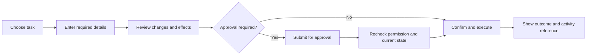

# Vectis Studio: UI/UX and product improvement plan

Prepared 13 September 2026. This plan extends [the engineering roadmap](../VECTIS_IMPROVEMENT_PLAN.md) and uses [the first milestone status](PHASE1_STATUS.md) as the implementation baseline.

## 1. Recommended direction

**Make Vectis a Spring Boot operations workspace where support teams can find information and complete authorized business tasks without writing SQL.**

The opportunity is a complete experience: understand a record, choose a meaningful task, review its consequences, make the change, and verify the outcome. A better-looking database editor alone will be difficult to distinguish from existing tools.

Developers remain essential: they install Vectis, select exposed data, supply business rules, and configure permissions. The resulting workspace should be usable by people who do not know Java, SQL, or the database schema. Describe this clearly in product messaging; Vectis is currently an embedded Spring Boot/JPA library, not a standalone tool that connects to every database.

Suggested product promise to validate with users:

> Help your support team resolve routine requests without SQL or repeated developer intervention.

Do not advertise production safety, universal compatibility, guaranteed rollback, or superiority over competitors until the corresponding behavior has been demonstrated.

## 2. Evidence and comparison boundaries

For Vectis, this review inspected the running local application's login, overview, team-member table, action menu, and edit form, including a desktop screenshot at 1280 × 720. It also inspected templates, JavaScript, metadata, query/controller code, sample actions, and the previous test report. No business records were changed during this review. The prior milestone recorded 33 passing tests; this planning pass did not rerun that suite.

For competitors, the review used official product pages, documentation, repositories, and selected public issue reports. Neither competitor was installed or subjected to an equivalent runtime test. An issue report is a reported problem, not proof that every release or deployment is affected. A feature not found in the reviewed documentation is marked unverified rather than absent.

KraftAdmin's official site currently points to `bowerzlabs/kraftadmin`; older search results point to `nyadero/kraftadmin`. The current site and linked repository are the comparison baseline. Its hosted demo page currently says the demo is forthcoming, so it was not treated as a working interactive benchmark. [Official repository](https://github.com/bowerzlabs/kraftadmin), [demo status](https://www.kraftadmin.io/demo).

### Capability comparison

| Capability | KraftAdmin: documented | SnapAdmin: documented | Vectis: current position |
|---|---|---|---|
| Generated CRUD, tables, relationships | Yes | Yes | Present; mapping coverage still needs broader testing |
| Search and filtering | Yes | Advanced search and filtering | Global/text search and enum shortcuts; structured filter builder pending |
| Field customization | Broad field components, validation, file support | Formatting/naming annotations and computed columns | Labels/descriptions and inferred controls; presentation metadata is limited |
| Business actions | Service actions, input forms, permissions, confirmation, bulk options | Equivalent service-action workflow not established in reviewed sources | Entity/service actions and explicit preview callbacks; general action-input UI pending |
| Authorization | Spring Security integration and configurable access; action permissions documented | Host Spring Security configuration | Deny-by-default fallback, administrator/read-only roles and entity/action checks; richer field/record policies pending |
| History | Equivalent audit guarantees not established in reviewed sources | Write-operation logs | Activity history and reasons; shared transaction guarantees remain unfinished |
| Export and SQL | Equivalent scope not established in reviewed sources | CSV, XLSX, JSONL; SQL console with saved queries | Export not implemented; no SQL console offered |
| Preview of proposed field changes | Equivalent contract not established in reviewed sources | Equivalent contract not established in reviewed sources | Explicit callbacks exist; limited projection, not universal simulation |
| Multi-person approvals and durable retry handling | Equivalent guarantees not established in reviewed sources | Equivalent guarantees not established in reviewed sources | Proposed, not implemented |
| Appearance and device support | Dark mode and responsive UI advertised | Appearance customization documented | Dark-oriented interface; responsive/accessibility work incomplete |

Sources: [KraftAdmin overview](https://www.kraftadmin.io/), [action documentation](https://www.kraftadmin.io/docs/actions/actions), [security documentation](https://www.kraftadmin.io/docs/security/overview), [SnapAdmin overview](https://www.snapadmin.dev/), [reference guide](https://www.snapadmin.dev/docs/), [repository](https://github.com/aileftech/snap-admin).

**Implication:** CRUD, annotations, search, custom actions, and dark mode are competitive basics. Vectis cannot claim those as unique. Explicit previews are a useful foundation, but their value depends on understandable presentation, execution consistency, and trustworthy results.

## 3. Lessons to apply without making unsupported claims

| Evidence or tradeoff | Lesson for Vectis | Concrete response |
|---|---|---|
| SnapAdmin documents that field hiding is presentation behavior, not a security control | Users and integrators must understand the difference between a hidden column and inaccessible data | Separate presentation preferences from server-enforced field policy; apply policy to search, forms, relationships, previews, history and exports |
| SnapAdmin delegates access configuration to the host and discusses protecting authentication-related entities | Quick setup must not accidentally expose privileged records | Keep deny-by-default behavior, explicit exposure, role examples, and negative permission tests |
| A SnapAdmin user reports blank entity pages after a template compatibility problem | Successful compilation does not prove generated screens work | Add rendered-page/browser smoke coverage across the versions Vectis explicitly supports |
| SnapAdmin reports include table scrolling and nullable foreign-key behavior | Common edge cases are part of usability | Test wide tables, missing relationships, large selectors, and empty datasets early |
| KraftAdmin already offers rich configurable actions | A custom-action button is insufficient differentiation | Make eligibility, before/after changes, declared effects, recovery, and the outcome easy to understand |
| KraftAdmin labels its framework an early development preview | Clear release expectations help integrators judge risk | Publish tested compatibility, limitations, upgrade notes and sample workflows with each release |

Sources: [SnapAdmin reference guide](https://www.snapadmin.dev/docs/), [blank-page report #68](https://github.com/aileftech/snap-admin/issues/68), [table-scroll report #66](https://github.com/aileftech/snap-admin/issues/66), [nullable relationship report #59](https://github.com/aileftech/snap-admin/issues/59), [KraftAdmin actions](https://www.kraftadmin.io/docs/actions/actions), [KraftAdmin development status](https://www.kraftadmin.io/docs).

Vectis is already repeating some category-level problems: exposing implementation details, crowding wide tables, and relying on generic action terminology. Its first milestone corrected several functional and permission defects, but that does not establish complete usability or production readiness.

## 4. Current Vectis UI/UX findings

| Priority | Observed behavior | Effect on users | Planned correction |
|---|---|---|---|
| P0 | “Grant 15% Bonus” multiplies annual salary by 1.15 | A user could expect a one-time payment and make a permanent salary change | Rename to “Increase annual salary by 15%”; implement a separate bonus workflow only if the domain supports it |
| P0 | Termination copy promises access revocation, but its handler only changes status and salary | The displayed outcome overstates what the application does | Remove that promise or implement and verify the actual integration; resolve the existing salary-validation conflict |
| P1 | ID, Version and database-type badges lead the table; status, department and actions extend beyond the visible desktop area | Users scroll to reach important information | Default to a small business-oriented column set, with technical details optional |
| P1 | “Operator ID,” “Passcode,” “Authenticate,” “ATTRIBUTES,” “fk,” “Collection,” and raw enum values appear in the interface | The product assumes technical familiarity | Use Username, Password, Sign in, Details, Related records and human-readable status labels |
| P1 | Every decimal is formatted with a dollar sign in the table template | Non-currency decimals or other currencies can be misrepresented | Explicit number/currency/unit metadata and a shared formatter |
| P1 | “Toggle Leave” does not name the resulting state; a critical termination action appears first in the observed menu | Consequences and frequency are poorly communicated | Contextual actions such as “Place on leave” and “Return from leave”; deliberate ordering and separated destructive actions |
| P1 | Enum shortcuts populate the general search parameter | A status shortcut does not express an independent, typed condition | Separate exact field filters from text search; combine them visibly |
| P1 | Form error handling has a general banner, but the template lacks per-field server-error bindings | Users must locate the problem themselves | Field-specific errors, linked summary, focus management, retained values |
| P1 | Form headings use plural resource names, such as “Edit Team Members” | Users lack clear confirmation of the individual being edited | Singular resource labels and record identity in headings |
| P1 | Relationship form options use `findAll`; detail loading initializes collections | Large real datasets can make basic tasks slow | Searchable, paginated relationship pickers and related-record lists |
| P1 | Numerous 9–12px labels, dark surfaces and subtle text; no complete modal focus-management implementation found | Readability and keyboard accessibility need deliberate work | Shared type/spacing tokens, theme support, keyboard and assistive-technology checks |
| P2 | Overview emphasizes section counts, activity count and static online indicators | The home screen gives little guidance about the next task | Show configured frequent tasks and saved views; add real work queues only when backed by data |
| P2 | The overview promises activity “in real-time”; detail metadata says “Synced with your database” | Users may infer freshness guarantees that are not established | Show “Last loaded” or an actual refresh timestamp; remove unsupported status claims |

Local evidence: [table template](../vectis-core/src/main/resources/templates/vectis/fragments/table.html), [layout](../vectis-core/src/main/resources/templates/vectis/layout.html), [dashboard](../vectis-core/src/main/resources/templates/vectis/dashboard.html), [detail](../vectis-core/src/main/resources/templates/vectis/detail.html), [form fragment](../vectis-core/src/main/resources/templates/vectis/fragments/edit-form.html), [controller](../vectis-core/src/main/java/io/github/yavonalabs/vectis/core/web/AdminController.java), [query engine](../vectis-core/src/main/java/io/github/yavonalabs/vectis/core/query/DynamicCriteriaQueryEngine.java), [employee actions](../vectis-sample-app/src/main/java/com/example/demo/entity/Employee.java), [service actions](../vectis-sample-app/src/main/java/com/example/demo/service/EmployeeOperationsService.java).

## 5. Primary users and the experience to optimize

| User | Job to complete | Successful experience |
|---|---|---|
| Support operator | Resolve a routine request | Find the correct person, perform a permitted task, copy a clear result into the support case |
| Supervisor | Review a sensitive request | See the proposed change, business justification and requester; approve or reject when approvals are available |
| Read-only reviewer | Understand what happened | Inspect permitted records and policy-allowed activity without mutation controls |
| Integrating developer | Enable these workflows | Configure selected resources and existing services, diagnose unsupported mappings, verify permissions without writing a frontend |

Start with one target segment: small Spring Boot teams whose support staff frequently ask developers to find or update application records. Validate this segment through interviews rather than assuming every admin-console user has the same needs.

The existing team-member sample is useful for testing. For adoption, add a support-oriented example such as customer-account maintenance. Any action involving identity, payments, or access must call real host business services; changing a database status is not sufficient evidence that an external operation happened.

## 6. Proposed navigation and screen design

### A. Application shell and home

Use the product name **Vectis Studio** consistently, while allowing the host application to configure its title and logo. Keep the real environment label visible. Add a user menu with role/context information and sign-out through the host security integration.

Proposed navigation:

- Home
- People / Customers / Orders: developer-configured business groups
- Saved views: once implemented
- Activity: only when permitted
- Approvals: only after the workflow exists and the user has access
- Developer details: a presentation preference for eligible users

Operator view should be the default. Developer view reveals permitted IDs, versions and schema details; it must never grant permissions or reveal otherwise forbidden fields. Use one component system with progressive disclosure rather than maintaining two unrelated interfaces.

Home should answer “What can I do here?” Show a few configured tasks, useful saved views and accessible recent activity. A new installation gets an explanatory empty state. Do not show invented queue counts, placeholder metrics or simulated system-health badges.

**Acceptance:** a first-time operator identifies a relevant section or task within 30 seconds; the interface has no empty navigation groups; every visible control works.

### B. Record lists and search

For team members, default columns should be **Name, Email, Department, Status, Actions**. Salary is optional and policy-controlled. IDs and versions belong in developer details. Combine first/last name visually without changing stored fields.

Provide an obvious record link, not only a clickable row. Keep the record identity and action entry accessible when a wide table must scroll. Offer comfortable and compact density, column selection, a reset-to-default option, and persistent preferences scoped to the user and resource.

Make text search and filters distinct. Begin with flat AND conditions and type-appropriate operators; add nested AND/OR only after the simpler model is tested. For example:

| Field | Condition | Value |
|---|---|---|
| Department | is | Engineering |
| Status | is | On leave |
| Annual salary | is greater than | 100,000 USD |

Display a readable summary above the results. Show active filter chips, Clear filters, a meaningful count and a helpful no-results state. Saved views should preserve filters, sort and visible columns; shared views must re-evaluate each viewer's permissions. Keep filters and sort stable through pagination, navigation and browser Back. Do not persist sensitive search values in URLs or shared views without a defined host policy.

Global search should group permitted results by business section, show disambiguating labels, support keyboard navigation, and explain why a search returned no matches without revealing inaccessible records.

**Acceptance:** exact status filtering remains exact even when similar text appears in other fields; name/status/actions fit the default desktop layout; no page-level horizontal overflow at narrow widths; all result links and controls work with a keyboard.

### C. Record detail and quick view

Lead with the person's or object's business name, a secondary identifier, status, and the two or three facts that distinguish it. Use **Details, Related records, Activity** as progressively loaded sections where appropriate. Render “Not provided,” “No department assigned,” and “No skills added” instead of database null/collection terms.

Present one common next action prominently, then an ordered menu. Keep destructive operations in a separate group. Explain business-state restrictions where appropriate: “Return from leave is available only while this person is on leave.” Permission-denied operations should follow the host's disclosure policy and remain denied at the server.

Keep quick view lightweight: summary, key facts and an explicit full-detail link. Support Escape, restored focus, and a clear close control. Preserve the list's filters, page and scroll position when returning.

**Acceptance:** users can confirm identity and current status before choosing an action; related records load in bounded pages; history links still make sense after deletion or renaming.

### D. Create/edit forms

Use a singular title such as “Edit team member: Alice Vance.” Group fields into business sections such as Contact information and Employment. Put required and frequently used fields first. Supply helpful descriptions, enum labels, examples, correct date/time controls and explicit units.

For validation, return structured field errors and a general error separately. Associate error text with its input, focus the summary or first invalid field, and preserve all permitted values and the reason. Explain business rules before submission where possible.

Replace unbounded relationship selects with search and pagination. Distinguish “No assignment” from “You cannot change this assignment” without exposing restricted data. Add many-valued editing only with clear membership semantics and permission tests.

Use a persistent action area for long forms, warn before discarding unsaved edits, and describe the result of saving. Avoid mandatory multi-step wizards for small forms. For sensitive changes, route through review after a shared mutation lifecycle exists. Keep reasons aligned with server policy; shorten repeated effort using reason categories and a separate optional ticket reference rather than fabricated default reasons.

**Acceptance:** invalid input never clears unrelated fields; changing one field does not alter omitted relationships; stale edits show a comparison instead of silently overwriting; Cancel returns to the expected context.

### E. Guided actions and review

Use the same sequence across supported actions:

Approvals and the complete lifecycle in this diagram are proposed. They are not part of the current release.

The review must show the target record, action-specific title, before/after values, units, reason, and the configured consequences. Replace a generic confirmation with “Place Alice on leave” or “Increase annual salary by 15%.” Explain concrete consequences alongside any risk label.

Distinguish projected field changes from declared external effects. “No visible field changes” must not imply that an email, webhook or remote action is harmless. If an effect cannot be previewed, say so. Preview callbacks remain trusted developer code and must not be presented as a sandbox.

Define loading, validation error, preview unavailable, ready, submitting, completed, rejected, stale and unknown-outcome states. An unknown outcome after a network failure requires status lookup by operation ID, not an automatic second execution. Button disabling is useful feedback but does not replace durable duplicate protection.

**Acceptance:** preview does not run the execute handler; parameters changing after preview invalidate it; stale or unauthorized execution is rejected; retries cannot repeat the same operation; the result identifies what actually completed. These require backend changes, not just modal styling.

### F. Activity, errors and recovery

Show a readable sentence, timestamp with timezone, actor, record label, reason and actual outcome. Add per-record field changes where permitted, with technical metadata collapsed. Distinguish requested, approved, executing, succeeded and failed events once those states exist. Keep private values out of lower-privilege history views.

Error messages should tell users what happened and the next safe step. Example: “This record changed while you were editing. Review the latest values before saving.” Preserve an operation reference for investigation.

Offer undo only through an explicitly implemented compensating action with fresh permissions and validation. Deleting a record, sending an email and reversing a payment do not have equivalent recovery semantics. Start with clear recovery instructions rather than a universal Undo button.

## 7. Visual system and accessibility

Keep the restrained Vectis accent color, but reduce glowing effects, excessive uppercase labels, tiny metadata and repeated nested borders. Establish shared tokens for typography, surfaces, borders, focus, spacing and status colors. Use a normal sans-serif font for business information; reserve monospace for permitted technical values.

Initial design targets: 14–16px primary content, 12–14px secondary content, 40–44px common controls, clear hierarchy, and visible focus. These are product targets rather than a claim that one font size proves accessibility. Support light, dark and system preference using the same components. Status semantics must be configured; the current template should not classify every unfamiliar enum as an error.

Target WCAG 2.2 AA. Verify text contrast, keyboard operation, visible focus, meaningful labels, accessible authentication, error association, status announcements, zoom/reflow and modal focus behavior. Use larger touch targets as a design preference; apply the standard's actual criteria and exceptions when auditing. [W3C WCAG quick reference](https://www.w3.org/WAI/WCAG22/quickref/).

Test at 390px, 768px and 1280px widths, plus 200% zoom and applicable reflow checks. On smaller screens collapse navigation, prioritize record identity/status, and open complex review flows as full pages. Tables may have their own scroll area; essential actions must remain reachable. Bundle production assets locally and test without CDN availability so a network restriction does not break the interface.

## 8. Extra features most likely to earn adoption

These are hypotheses to validate with target teams, not claims of exclusive functionality.

| Rank | Feature | User value | Prerequisite / scope limit |
|---|---|---|---|
| 1 | Business task templates | Common support requests become named, guided actions | Start with 3 complete workflows using host services; framework templates must not invent domain behavior |
| 2 | Visual filters and shared saved views | Operators repeatedly find the right work without asking for SQL | Typed query model, permissions and durable view storage |
| 3 | Explainable change review and outcome receipt | Users understand impact and can document the result in a support case | Shared validation, concurrency, audit and operation lifecycle |
| 4 | Searchable relationship selection | Large real datasets remain manageable | Bounded endpoints, identity labels and scoped results |
| 5 | Developer integration diagnostics | Integrators discover unsupported mappings and unsafe exposure before operators do | Clear compatibility report; developer-only diagnostics with no secrets |
| 6 | Request/approve sensitive changes | Supervisors can delegate work with control | Durable approval state, self-approval rules, expiry, revalidation and audit |
| 7 | Policy-aware export | Teams share useful filtered data without manual queries | Same row/field policies, column selection, limits, CSV formula handling and auditable downloads |
| 8 | Data-quality work queues | Teams can find missing assignments or inconsistent records and fix them | Host-defined checks with bounded queries; no invented generic business rules |
| 9 | Bulk action review and import validation | Repetitive work becomes faster | Job lifecycle, frozen selection semantics, per-record outcomes, duplicate protection and partial-failure policy |
| 10 | Optional natural-language search | Users can describe a query in their own words | Translate into visible, editable approved filters; no silent execution of generated SQL or write actions |

A reasonable first differentiating bundle is **guided tasks + clear change review + shared saved views + permission-aware activity**. Publish a short demonstration where an operator resolves a real support request without developer assistance. That is a stronger reason to adopt than a long feature checklist.

Additional retention features after validation: personal favorites, recent records with permission rechecks, shareable record links, ticket-reference integration, documented extension hooks, localized labels, and reusable domain starter examples. Keep deployment inside the host application and document data flows; if optional AI or connectors are introduced, make their data access explicit.

Defer a raw SQL console, general dashboard designer, arbitrary workflow builder, broad file-storage ecosystem and AI writes. They expand scope considerably and do not resolve the current onboarding, correctness and everyday-task problems. Export is useful parity; it should not displace the first complete operator workflow.

## 9. Implementation architecture

Extend the current Spring MVC/Thymeleaf/HTMX/Alpine stack incrementally. A frontend rewrite is not necessary to fix the observed problems.

| Area | Implementation direction | Likely code locations |
|---|---|---|
| Presentation metadata | Singular/plural names, display labels, field order/group, default columns, enum labels, units/currency and descriptions | `AdminField`, `FieldDescriptor`, `EntityDescriptor`, `RecordPresentation` |
| Component system | Shared button, field/error, badge, dialog, empty-state, pagination and table patterns; local CSS/assets | `templates/vectis/*`, `static/vectis-assets/*` |
| Query state | Typed filters independent of search, stable sort/page state and bounded association lookup | `DynamicCriteriaQueryEngine`, `AdminController`, new filter/view services |
| Action description | Structured inputs, eligibility, proposed changes, declared effects and recovery metadata | Action registry/descriptors, `ActionPreviewController` |
| Mutation lifecycle | Shared permission/validation, operation IDs, concurrency, transaction/audit rules, result lookup | Mutation service extraction plus audit and action execution code |
| User preferences | User/resource scoped columns, density and views; authorization on every load | New preference/view storage and endpoints |
| Policy coverage | Consistent field/record scope through every read and mutation surface | Permission evaluator and all query/presentation paths |
| Adoption | Working examples, setup diagnostics, versioned compatibility evidence | Sample app, documentation and CI |

Presentation configuration and authorization must remain separate. A column picker cannot turn a restricted field back on. Approved requests must carry a stable target, input and version; edits to those inputs invalidate approval. For external effects, define completion and retry semantics explicitly, using a durable job/outbox approach where suitable.

Start with one shared deterministic change calculation for preview and execution where possible. Independent preview logic that slowly diverges from execution will undermine the central product promise.

## 10. Delivery plan and dependencies

Planning range: roughly **12–16 weeks for an operator beta**, assuming one experienced full-time engineer with recurring design, QA and user feedback support. This is an estimate, not a commitment. Re-estimate after the first workflow and transaction design; broader approvals, imports and AI may extend beyond it. The order below refines the existing roadmap rather than declaring its unfinished safety work complete.

| Phase | Indicative window | Deliverables | Exit gate |
|---|---|---|---|
| 0: Validate and correct meaning | Week 1 | Baseline user tasks; fix misleading sample action copy/rules; agree one target segment; inventory screens and states | Users and developers agree what the first 3 tasks actually do |
| 1: Operator interface foundation | Weeks 2–3 | Shared styling, readable tables, singular names, semantic statuses, actual currency formatting, accessible navigation, field errors and form context | Find/view/edit journey works without schema jargon and with keyboard access |
| 2: Find and understand records | Weeks 4–6 | Typed filters, bounded relationship search, saved personal views, improved details/activity, restored navigation state | Users find the correct records without SQL; performance and permission checks pass |
| 3: Trustworthy task execution | Weeks 7–10 | Structured inputs/review; shared mutation validation; concurrency; transaction/audit rules; duplicate protection; operation outcomes | Concurrent edits, retries and preview/execute consistency tests pass |
| 4: Pilot and harden | Weeks 11–12 | 3 polished task templates, integration guide/diagnostics, compatibility checks, accessibility pass and supervised pilot | Measured operator success and no unresolved release-blocking defects |
| Contingency / selected extension | Weeks 13–16 | Address pilot feedback; choose shared views, controlled export or a narrow approval flow based on demand | The selected capability has its own tests and release gate |

Do not release new sensitive mutation flows before Phase 3's backend gate. Early UI improvements can be evaluated with read-only or disposable demo data. Approvals, imports and bulk actions should not be scheduled as trivial additions to a modal.

### First implementation backlog

| ID | Priority | Reviewable task | Acceptance criterion |
|---|---|---|---|
| UX-01 | P0 | Correct sample action semantics | Labels, preview, handler and documented effects agree; termination validation decision is covered |
| UX-02 | P1 | Introduce presentation metadata | Existing integration defaults remain usable; metadata is backward compatible where possible |
| UX-03 | P1 | Build common visual tokens and accessible components | All touched components use the shared system; focus/contrast verified |
| UX-04 | P1 | Redesign the operator table | Name, status and action entry visible at normal desktop width; technical values optional |
| UX-05 | P1 | Add a shared semantic formatter | Decimal, currency, percentage, date/time, enum and empty values render according to declared meaning |
| UX-06 | P1 | Improve form feedback and context | Singular title, structured field errors, retained inputs and expected Cancel behavior |
| UX-07 | P1 | Add typed filters and stable navigation | Search/filter/sort/page composition survives Back, refresh and pagination |
| UX-08 | P1 | Replace unbounded association controls | Lookup uses scoped pages; missing, restricted and unassigned values handled correctly |
| UX-09 | P1 | Build the complete action state model | Action review shows identity and consequences; failure/retry behavior matches the server contract |
| UX-10 | P2 | Replace overview with useful task entry points | Only configured working tasks/views appear; no unsupported freshness claims |
| UX-11 | P2 | Add saved views and better activity | Saved views cannot reveal forbidden data; history has readable record labels and outcomes |
| UX-12 | P1 | Package the pilot and release checks | Supported-version browser checks, setup guide and measured task results are published |

Effort should be estimated after the metadata and mutation contracts are agreed. UX-09 depends on the engineering roadmap's unfinished execution guarantees; it cannot be completed as a template-only change.

## 11. Validation and success measures

Recruit five to eight representative operators and two integrating developers for an initial qualitative round. Do not interpret this sample as statistical proof. Give participants realistic tasks without telling them which buttons to use: find someone by email, isolate people on leave in one department, correct a field, handle a validation error, preview a sensitive change, and explain whether an operation completed.

Record the current baseline before redesign, then repeat equivalent tasks. Proposed pilot targets, to refine after baseline measurement:

| Measure | Initial target |
|---|---|
| Find and identify the correct record | At least 90% unassisted completion in under 60 seconds |
| Complete one routine allowed task | At least 90% unassisted completion in under 2 minutes |
| Explain the proposed change before confirming | At least 90% correctly identify the target and main consequence |
| Recover from a validation error | No lost permitted input; correction without facilitator assistance |
| Developer setup on a supported example | First usable read-only resource within 15 minutes using documentation |
| Operational value | Fewer routine requests escalated to developers, measured during a pilot against its baseline |
| Query responsiveness | Provisional p95 under 1 second for common indexed list/filter queries on a documented 100,000-record fixture and stated hardware |

Track task starts, completions, failures and durations only with the host's telemetry policy. Avoid collecting record contents or sensitive search strings. Also track users returning to complete a second real task; a successful installation alone does not demonstrate adoption.

Release checks must cover keyboard and screen-reader workflows; dialog focus and error announcements; small screens and zoom; slow/failed requests; empty/large datasets; nullable relationships; supported IDs and temporal/numeric fields; custom base/context paths; permission boundaries; simultaneous edits; repeated submissions; audit consistency; and actual database compatibility. Include real supported database fixtures beyond H2 before claiming broader compatibility.

Keep meaningful regression tests for permissions and mutations. Add browser checks for complete user journeys and critical render states rather than fragile assertions of every CSS class. Zero observed failures in a finite test suite is evidence for the covered cases, not a universal safety guarantee.

## 12. Recommended first release story

Demonstrate three things convincingly:

1. An operator finds the correct record using plain-language fields and filters.
2. The operator completes a host-defined business task with a comprehensible preview and clear outcome.
3. A developer can explain and verify exactly what that operator is allowed to see and do.

If Vectis makes those tasks easier while integrating reliably into an existing Spring application, teams have a concrete reason to choose it. Broader feature investment should follow observed pilot demand.
